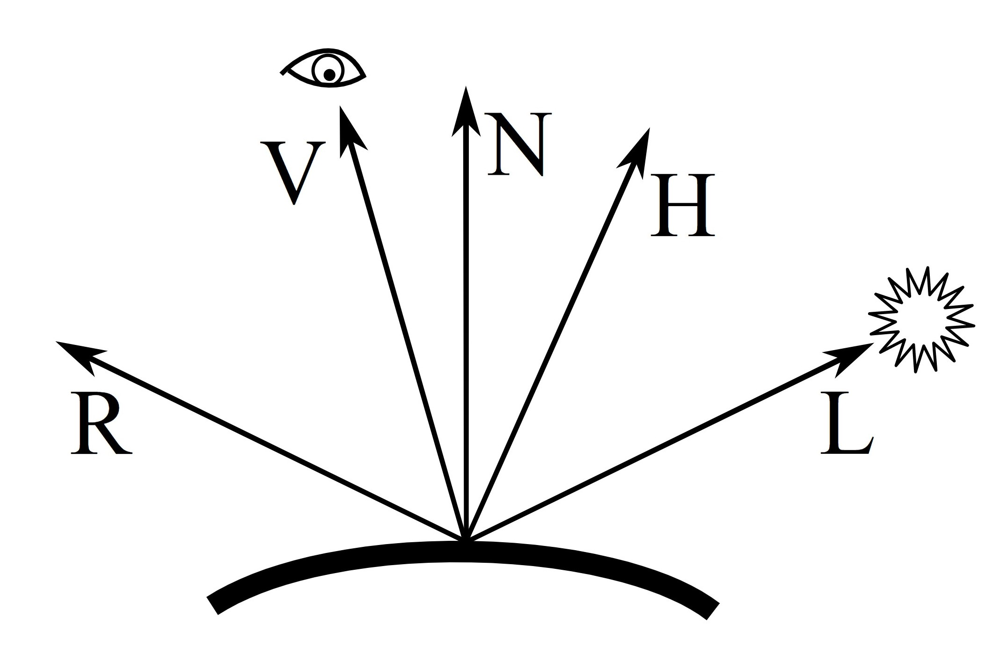
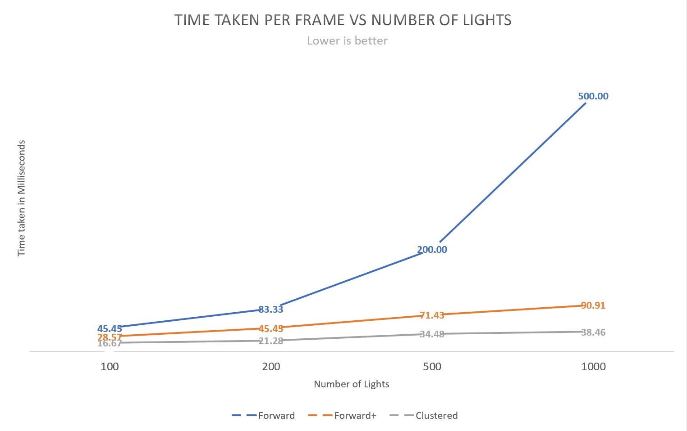

WebGL Clustered and Forward+ Shading
======================

**University of Pennsylvania, CIS 565: GPU Programming and Architecture, Project 6**

* Author : Kushagra
  * [LinkedIn](https://www.linkedin.com/in/kushagragoel/)
* Tested on : Windows 10, i7-9750H CPU @ 2.60GHz 16GB, GTX 1650 4GB (Personal Computer)

### Live Online
https://kushagra-goel.github.io/Project6-WebGL-Clustered-Deferred-Forward-Plus/

## Table of Contents  

1. [WebGL](#intro)  
2. [Features](#features)   
3. [Performance Analysis](#analysis)  

<a name = "intro"/>  

## WebGL
WebGL (Web Graphics Library) is a JavaScript API for rendering interactive 2D and 3D graphics within any compatible web browser without the use of plug-ins. WebGL is fully integrated with other web standards, allowing GPU-accelerated usage of physics and image processing and effects as part of the web page canvas. WebGL elements can be mixed with other HTML elements and composited with other parts of the page or page background. WebGL programs consist of control code written in JavaScript and shader code that is written in OpenGL ES Shading Language (ESSL), a language similar to C or C++, and is executed on a computer's graphics processing unit (GPU). WebGL is designed and maintained by the non-profit Khronos Group.

<a name = "features"/>   

## Features Implemented

### Forward   
Forward rendering is the standard, out-of-the-box rendering technique that most engines use. You supply the graphics card the geometry, it projects it and breaks it down into vertices, and then those are transformed and split into fragments, or pixels, that get the final rendering treatment before they are passed onto the screen.  

 

  
   
    
    

### Forward+  
Forward+ improves upon regular forward rendering by first determining which lights are overlapping which area in screen space. During the shading phase, only the lights that are potentially overlapping the current fragment need to be considered.   

  

### Deffered    
In deferred rendering, as the name implies, the rendering is deferred a little bit until all of the geometries have passed down the pipe; the final image is then produced by applying shading at the end. Deferred lighting is a modification of deferred rendering that reduces the size of the G-buffer by using more passes on the scene. Here is the render without the Plinn-Phong reflection model.   

  

### Deferred Blinn-Phong shading  
In Phong shading, one must continually recalculate the dot product R.V between a viewer (V) and the beam from a light-source (L) reflected (R) on a surface.  
  

If, instead, one calculates a halfway vector between the viewer and light-source vectors,
(A "halfway vector" (if you mean that by "half vector") is the unit vector at the half angle between two other vectors. Normally the halfway vector is computed between the vector to the viewer v and the light source l) R. V can be replaced with N.H for better reflections.   

  

<a name = "analysis"/>  

 ## Performance Analysis    
 
    

The values were calculated for a reduced resolution render using the frames per second counter in the project. As we expected clustered shading is vastly superior to forward shading and to an extent superior to forward+ shading too. Our optimization of using less than 4 g_buffers is also potentially helping clustered be faster than others.

### Credits

* [Three.js](https://github.com/mrdoob/three.js) by [@mrdoob](https://github.com/mrdoob) and contributors
* [stats.js](https://github.com/mrdoob/stats.js) by [@mrdoob](https://github.com/mrdoob) and contributors
* [webgl-debug](https://github.com/KhronosGroup/WebGLDeveloperTools) by Khronos Group Inc.
* [glMatrix](https://github.com/toji/gl-matrix) by [@toji](https://github.com/toji) and contributors
* [minimal-gltf-loader](https://github.com/shrekshao/minimal-gltf-loader) by [@shrekshao](https://github.com/shrekshao)
